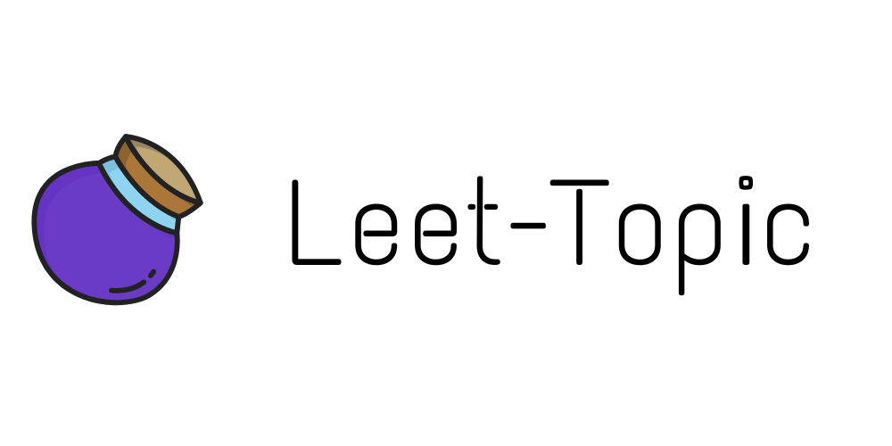

LeetTopic builds upon Top2Vec, BerTopic and other transformer-based topic modeling Python libraries. Unlike BerTopic and Top2Vec, LeetTopic allows users to control the degree to which outliers are resolved into neighboring topics.


```{python}
import pandas as pd
from leet_topic import leet_topic

df = pd.read_json("data/vol7.json")
documents = df.descriptions.tolist()
new_df, topic_data = leet_topic.LeetTopic(documents, max_distance=.9)
```
